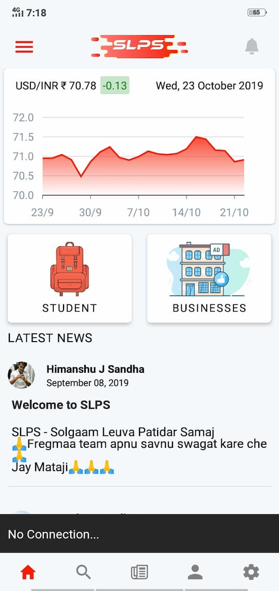

When building an Online first Applications, you should always think of what happens when there is no connectivity.
We don't want our users to look at an empty screen or loading indicator forever. Do we?

So when creating an application, you should always show your users something, like a cached data or message that indicates the user that they've lost the Internet connectivity.

I just added this in one of my React Native application called SLPS.
I'll show you how you can add to your React Native Project.



It's quite simple, all we need is to know the current status of connectivity and we need to subscribe to connection changes.

`NetInfo` module from React Native allows us to check for Network connection, but the NetInfo module was removed from React Native as a [lean core](https://facebook.github.io/react-native/blog/2018/11/01/oss-roadmap) initiative.

Now, It's moved to `React-Native Community`, which manages many commonly used React-Native packages.

To Install the [NetInfo](https://github.com/react-native-community/react-native-netinfo) package to your React Native Project.

```bash
yarn add @react-native-community/netinfo

or

npm install --save @react-native-community/netinfo

```

If you are using `React Native <0.60` make sure you follow the guide on gihub to link the package properly to your project.

Done?

Alright now let's start using it in our project, We want to subscribe to network change and keep the state so that we can show a proper fallback when network goes offline.

We can add Netinfo listener to the top level component or just a part of your application depending on where we want to show fallback.

Let's add it to the top component and start listening to Network change, we have to use `addEventListener` method which takes a callback with network state.

```js
// App.js
import NetInfo from "@react-native-community/netinfo"; // Import the package

// Subscribe
const unsubscribe = NetInfo.addEventListener(state => {
  console.log("Connection type", state.type);
  console.log("Is connected?", state.isConnected); // true or false
});

// Unsubscribe
unsubscribe();
```

Okey now we know the current state of the network but how we supposed to act when network changes?
Simple just save the network state to your React State. So everytime state changes we can display appropriate fallback.

```js
// App.js
import NetInfo from "@react-native-community/netinfo"; // Import the package

function app() {
  const [state, setState] = useState();
  useEffect(() => {
    const unsubscribe = NetInfo.addEventListener(state => {
      console.log("Is connected?", state.isConnected); // true or false
      setState(state); // save the network state to React State.
    });
    return () => {
      unsubscribe(); // Unsubscribe to listener when component unmounts
    };
  }, []);

  return (
    <View>{state.isConnected ? <FallBackComponent /> : <MyComponent />}</View>
  );
}
```

Now, this is just for the `App` component. If you want to obtain the state throughout the application you should use [React Context](https://reactjs.org/docs/context.html) or Redux(if already installed otherwise just use Context).
